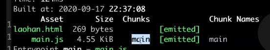

## Webpack概念

模块打包器

## 1. hbs

模版库
hbs是一个运行在Express上, 对Handlerbars模板引擎再次封装的视图引擎.

## 2.cjs

[Javascript 中的 CJS, AMD, UMD 和 ESM是什么？](https://juejin.cn/post/6935973925004247077)

- 由于 `ESM` 具有简单的语法，异步特性和可摇树性，因此它是最好的模块化方案
- `UMD` 随处可见，通常在 `ESM` 不起作用的情况下用作备用
- `CJS` 是同步的，适合后端
- `AMD` 是异步的，适合前端

## 3. 安装

### 3.1 环境准备

* nodeJs 升级到最新版本

### 3.2 4.x版本

```
//局部安装方式 推荐
npm install webpack@v4.46.0 webpack-cli -D
//全局方式安装
npm install webpack webpack-cli -g
```

## 4  启动

```
npx webpack
```

或者

```
package.json 
  "scripts": {
    "dev": "webpack"
  },
npm run dev  
```

## 5 配置

* 默认零配置

* 自定义配置 webpack.config.js  

  scripts脚本如果没有指定对应的配置文件，默认走webpack.config.js

  ```
  "dev": "webpack --config ./webpack.xj.js"
  ```

* webpack.base.config.js

* wbepack.dev.config.js wbepack.pro.config.js

## 6 核心概念

* 何为零配置

  升级到4.x时候，支持零配置，零配置默认走./src/index.js下的文件为入口文件，

  不指定mode，同时output.path = path.resolve(__dirname, "./build"),

  output.filename = "main.js"

* 何为配置文件

  默认文件（webpack.config.js） 和自定义配置文件(通过 --config指定)

* entry

  打包入口

  * spa

    单页面入口

  * mpa

    多页面入口

  支持string array object
  ```
  entry: "./src/index.js",
  entry: {
    main: "./src/index.js"
  },
  ```
* output

  打包出口

  * path  输出资源的存放位置，必须是绝对路径

  * filename  资源名称 

  filename: "[name].js"
  占位符的概念 name就是entry里面的key值 ，占位符的好处就是指定多入口时，能build出
  对应的出口文件。
  常用的占位符 [name] [hash] [chunkhash] [contenthash],占位符可以组合
  filename: "[name]-[hash].js" 可以通过[hash:number]指定文件名称的长度
  如[hash:6]
  * 【hash:number】【chunkhash】【contenthash】的区别

    hash是代码发生变化，hash值就会改变，如果用hash占位符指定生成的css文件名称，一旦代码发生变化，会导致css文件名称也发生变化。但实际上css内容并没有发生变化，会造成资源重复下载。

    contenthash是自身内容发生改变，contenthash才会发生变化， 所以css文件名称可以用contenthash来指定，用来解决css缓存问题。

    chunkhash 是只有chunk的代码发生改变，chunkhash才会发生变化

* mode

  none development production

   webpack默认有内置插件， none就是不开启任何内置插件，development开启开发模式

    相关插件 production开启生产模式插件（比如压缩js代码的插件）

* loader

  webpack对前端来说只支持js模块和json模块， 引入loader模块转化器(模块处理器)，让webpack支持更多的模块。loader有执行顺序，自后往前。
  * css-loader: 引入css内容
  * style-loader: 把css插入到DOM中
  * less-loader: webpack 将 Less 编译为 CSS 的 loader。
  * postcss-loader: 使用 PostCSS 处理 CSS 的 loader。
  * file-loader: 图片（文件复制、挪移）
  * url-loader: 包含file-loader所有的功能

  postcss.config.js
  module.exports = {
    plugins: [
      require("autoprefixer")({
        //兼容can I use浏览器的最近两个版本
        //兼容市场占有率大于1%的浏览器
        //覆盖package.json配置的browserList
        //overrideBrowserslist: ["last 2 versions", ">1%"]
      })
    ]
  }
* plugin

  每次打包后有很多冗余的文件，还要手动创建index.html,针对这些问题，webpack引入插件的概念，进行功能扩展。 

  * html-webpack-plugin: 自动生成html模版
  const htmlWebpackPlugin = require('html-webpack-plugin')
  plugins: [new htmlWebpackPlugin({
    template: "./src/index.html",
    filename: "test.html",
    chunks: ["index"]
  })]
  htmlWebpackPlugin可以创建多个html文件, 通过chunks指定对应的入口文件。
  * clean-webpack-plugin: 清空冗余文件
  * mini-css-extract-plugin: 抽离css， 使用时候需要替换style-loader
  new MiniCssExtractPlugin({
    filename: 'css/index-[chunkhash:6].css',
  })
* chunk

  代码片段，打包后bundle文件里面用eval包裹起来的内容就是chunk。

* module 模块
  让webpack支持更多的模块
  module:{
    rules:[
      {
        test: /\.css$/,
        use: ["style-loader","css-loader","less-loader"],
      },
      {
        test: /\.(png|jpe?g|gif)$/i,
        use: {
          loader: "url-loader",
          options: {
            name: "[name].[ext]",
            outputPath: "images/",
            limit: 1024 * 2,// 小于2kb 转成base64
          }
        }
      },
    ]
  }
* bundle

  输出的资源文件就叫bundle文件，由webpack启动器函数+模块处理信息+chunks组成。

* bundle、chunk、module的区别  
  * 一个chunks可以对应一个或者多个模块
  * 一个模块对应一个chunk，在bundle文件中就是eval代码片段
  * 一个bundle对应一个chunks
  
  * bundle = webpackBootstrap（启动函数） + 模块处理信息 + chunks

*  有几个入口就有几个bundle的说法对不对？

  不对，一个入口可以做bundle拆分。

## 7 webpack前端项目工程化实战

### 7.1 pc端还是移动端

* 移动端spa
  * ssr
* pc端mpa
* 兼容性：需要兼容的浏览器和版本

### 7.2 多人参与还是单人

* 代码规范
* Eslint+ prettier
* 提交规范

### 7.3 技术栈

* vue
* react
* 样式
  * less
  * sass
  * postcss == babel
  postcss loader 用来处理css， babel用来处理js
* Ts & babel -> es6+
* 模版引擎
  * ejs
  * pug

* 是否需要支持三方字体（阿里巴巴普惠体）

### 7.4 工具类

* 安装依赖包 切换国内源 npm config
* .npmrc

## 8 自定义loader

多个loader 是有执行顺序的，自后往前

* 函数 声明式函数 不可以是箭头函数
  所有的api都挂在this上。
* 函数必须有返回值
  不返回值会报错。

  ```
  replace-loader.js
  
  module.exports = function (source) {
    return source.replace("webpack4", `${this.query.name}-webpackLearning4`)
  }
  ```

* 如何返回多值 this.callback

  ```
  replace-loader.js
  
  module.exports = function (source) {
    const result = source.replace("webpack4", `${this.query.name}-webpackLearning4`)
  	this.callback(null, result)
  }
  ```

  

* 如何处理异步操作 this.async

  ```
  replace-loader-async.js
  
  module.exports = function (source) {
    const callback = this.async()
    let timer = setTimeout(() => {
      clearTimeout(timer)
      const result = source.replace("webpack4", `${this.query.name}-webpackLearning4`)
      callback(null, result)
    }, 2000)
  }
  ```

* 如何处理多个自定义loader

  ```
  module: {
      rules: [
        {
          test: /\.js$/,
          use: [
            "replace-loader.js",
            {
              loader: "replace-loader-async.js",
              options: {
                name: 'xj'
              }
            },
          ],
          exclude: /dist/
        }
      ]
    },
  
  resolveLoader: {
      modules: ["node_modules", "./myLoaders"]
  },
  ```

## 9 Browerlist

### 9.1  定义

The config to share target browsers and Node.js versions between different front-end tools.  

 这个配置能够在不同的前端工具中分享目标浏览器和nodejs的版本，主要是为了表示当前项目的浏览器兼容情况。

```
使用方式一：
postcss.config.js
module.exports = {
  plugins: [
    require("autoprefixer")({
      //兼容can I use浏览器的最近两个版本
      //兼容市场占有率大于1%的浏览器
      //覆盖package.json配置的browserList
      overrideBrowserslist: ["last 2 versions", ">1%"]
    })
  ]
}

package.json
"browserslist": [
"last 2 versions",
">1%"
]

postcss.config.js > package.json ,package.json 单独写是没有作用的，需要依赖
postcss.config.js，如果postcss.config.js里面配置了就走它里面的配置，没有走
package.json里面的配置。.browserslistrc原理类似。

使用方式二：
.browserslistrc
last 2 versions
>1%
```

**package.json 和 .browserlistrc 单独使用都是没有用的，为了提供给其他插件或者工具使用的。比如**
**Autoprefixer**
**babel**

### 9.2 查看对应的浏览器

```
npx browserslist "last 2 versions, >1%"
```

## 10 devtool

* devtool: "inline-source-map",

  source-map 被保存在bundle文件内，会增大bundle文件的体积

*  devtool: "source-map",

  独立的source-map

  source-map 错误和源码的映射关系

## 11 多页面打包通用方案

```
const glob = require('glob')
const setMpa = () => {
  const entry = {};
  const htmlWebpackPlugins = []
  const entryFiles = glob.sync(path.join(__dirname, "./src/*/index.js"))
  console.log(entryFiles)

  entryFiles.map((item, index) => {
    const entryFile = item
    const entryName = entryFile.match(/src\/(.*)\/index\.js$/)[1]
    entry[entryName] = entryFile
    htmlWebpackPlugins.push(new htmlWebpackPlugin({
      template: path.join(__dirname, `src/${entryName}/index.html`),
      filename: `${entryName}.html`,
      chunks: [entryName, 'home'], // 模版依赖的chunks
    }))
  })
  return {
    entry,
    htmlWebpackPlugins
  }
}

const { entry, htmlWebpackPlugins } = setMpa()
```

## 12 本地开发服务

### 12.1 目的

提升开发体验

### 12.2 兼容性

webpack-dev-server 3.x版本 和webpack-cli 存在不兼容问题

```
webpack-cli 3.x 
scripts: {
 	"serve": "webpack-dev-server"
}

webpack-cli 4.x
scripts: {
 	"serve": "webpack serve"
}
```

### 12.3   注意事项

```
plugins: [new htmlWebpackPlugin({
    template: "./src/index.html",
    filename: 'index.html'
}),

```

**htmlWebpackPlugin的filename要设置为index.html，不然localhost:8080 默认不会走index.html, 而是会展示根目录的文件夹列表。**

```
If you're having trouble, navigating to the /webpack-dev-server route will show where files are served. For example, http://localhost:9000/webpack-dev-server.
```

**locahost:port/webpack-dev-server 就是打包后的文件所处的位置**

webpack-dev-server 其实就是将打包后的资源放在了内存中， 通过查看locahost:port/webpack-dev-server可以查看
打包后文件所处的位置（在内存中），但是如果没有指定一个出口html的话，会展示项目根目录的文件夹列表。

webpack-dev-server 还可以监听文件的变化自动构建并自动刷新
### 12.4 命令行参数

```
--no-stats : 不输出打包信息
--open: 自动打开浏览器
--port: 端口👌
--content-base: 本地服务存储的内容来源地址 
比如：--content-base dist/, 表示 locolhost:8081/的来源就是dist目录下
```

```
devServer: {
  open: true, //自动打开浏览器
  port: 8081, //端口号
  contentBase: path.join(__dirname, "dist"), //指定资源目录文件，如果输出目录就是dist，默认就是dist
  proxy: { //指定代理路径，当服务端还没有数据时，可以本地mock数据, 还可以用来解决跨域问题。
  "/api": {
    target: "http://localhost:9092/"
    }
  },
  hot: true, //配合css HMR使用
  hotOnly, //配合js HMR 使用， 不刷新浏览器
  publicPath: /dist/, 
  //通过访问 http://localhost:8081/webpack-dev-server 可以得到devServer启动后的资源访问路径，
  //点击静态资源可以看到静态资源的访问路径为 http://localhost:8080${publicPath}index.html
},
```

proxy 解决跨域问题
node  server.js
浏览器输入：http://localhost:9092/api/info
返回 
{
  name: "项布斯"
}

index.js
axios.get("http://localhost:9092/api/info/api/info").then(res => {
  console.log(res)
})
执行npm run serve

```
Access to XMLHttpRequest at 'http://localhost:9092/api/info/api/info' from origin 'http://localhost:8082' has been blocked by CORS policy: No 'Access-Control-Allow-Origin' header is present on the requested resource.

GET http://localhost:9092/api/info/api/info net::ERR_FAILED 404

```
解决方案
proxy: {
  "/api": {
    target: "http://localhost:9092/"
  }
},
axios.get("/api/info").then(res => {
  console.log(res)
})

### 13 HMR :hot module replacement 热替换模块

###  13.1 兼容性

hmr提升开发效率，不支持抽离出的css（miniCssExtractPlugin） ，开发环境还是要用style-loader+ css-loader，上生产环境再切换为miniCssExtractPlugin。

### 13.2 css更新

```
const webpack = require("webpack")

devServer: {
	hot: true, //在不刷新浏览器的情况下，更新css样式
},
plugins: [
  new webpack.HotModuleReplacementPlugin(),
]
```

### 13.3 js更新

```
devServer: {
  hotOnly: true, //浏览器不自动刷新
},
```

js模块更新的本质是删除一个模块，重新加入一个模块

```
number.js

const addNewButton = function () {
  var btn = document.createElement("button")
  btn.innerHTML = "新增2休闲鞋"
  btn.setAttribute("id", "customButton")
  document.body.appendChild(btn)

  btn.onclick = function () {
    var div = document.createElement("div")
    div.innerHTML = "item"
    document.body.appendChild(div)
  }
}

function number() {
  var div = document.createElement("div")
  div.innerHTML = "333"
  div.setAttribute("id", "number")
  document.body.appendChild(div)
}
export {
  addNewButton,
  number,
}

index.js
addNewButton()
number()
if (module.hot) {
  module.hot.accept("./number.js", () => {
    document.body.removeChild(document.getElementById("customButton"))
    document.body.removeChild(document.getElementById("number"))
    addNewButton()
    number()
  })
}
```

其他代码和框架

现代前端基本都是用框架来开发，如vue、react，很少用原生js来开发，所以会有封装好的loader，
可以使HMR与各种框架和库平滑的进行交互。
* React Hot Loader 实时调整react组件
* Vue Loader 此loader支持vue组件的HMR，提供开箱即用体验
* Elm Hot webpack Loader
* Angular HMR
* Svelte Loader

补充：

react-app-rewired是react社区开源的一个修改CRA配置的工具，例如扩展Create React App的Webpack配置，而customize-cra提供了一组用于自定义利用react-app-rewired核心功能的Create React App v2配置, 可以通过config-overrides.js文件来对webpack配置进行扩展 

## 14 babel

### 14.1 语法转化 

const ->var 

()=>{} function(){}

7.x 

​	env对标准的es6语法转化

​	flow 类型检查

​	react preset-react 支持jsx语法

​	typescript 支持ts语法

6.x

​	预设插件

	* babel-preset-es2015
	* babel-preset-es2016

 *  babel-preset-es2017
     *  tc39正式发布
        	*  技术委员会第39号，ecma的一部分
         *  精简了填案过程
            	*  Stage-0 想法阶段
            	*  Stage-1值得更进
            	*  Stage-2 指定规范
            	*  Stage-3 候选发布名单
            	*  Stage-4 完成
	*  babel-preset-latest
	*  babel-preset-stage-1
	*  babel-preset-stage-2
 *  babel-preset-stage-3
    	*  tc39草案阶段
	*  ...

## 14.2 特性补齐（polyfill）

* Promise symbol proxy 实例方法：[].find
* 解决方案 就是在目标环境中添加缺失的特性

### 14.3 配置文件

* .babelrc

  ```
  {
    "presets": [
      [
        "@babel/preset-env",
        {
          "targets": {
            //目标环境
            "edge": "17",
            "firefox": "60",
            "chrome": "67",
            "safari": "11"
          },
          "corejs": 3, //默认就是2，可以手动改为3，但是需要额外单独安装 npm i core-js@3 -D
          "useBuiltIns": "usage" //使用usage，不需要手动导入@babel/polyfill,会自动导入
        }
      ]
    ] //预设插件
  }
  
  ```

* babel.config.js

* package.json 直接写配置

* babel-loader

### 14.4 安装

```
npm install babel-loader @babel/core @babel/preset-env -D
babel-loader : webpack 沟通babel的桥梁
@babel/core: babel的核心模块，不做具体的任务处理，交给相关的生态插件处理
@babel/preset-env: 处理语法转化

```

### 14.5 配置

```
{
  test: /\.js$/,
  use: {
  loader: "babel-loader",
  options: {
    presets: ["@babel/preset-env"], //预设插件
    plugin: [],
  }
}
//@babel/preset-env es6语法转换
特性补齐需要在文件内 import "@babel/polyfill"，会导致bundle文件体积变大。
所以引入了按需加载。
```

### 14.6 按需加载

```
@babel/polyfill 默认依赖core-js2.x 和regenerator-runtime
"dependencies": {
  "core-js": "^2.6.5",
  "regenerator-runtime": "^0.13.4"
},
```

babel >=7.4.0, @babel/polyfill 已经被废弃，推荐独立安装和导入

```
import "core-js/stable"; //3.x
import "regenerator-runtime/runtime";
```

core-js2x 与3x的区别

3x支持的语法更多。

```
webpack配置文件
{
  test: /\.js$/,
  use: {
    loader: "babel-loader",
    options: {
    presets: [["@babel/preset-env", {
    targets: {
      //目标环境
      edge: "17",
      firefox: "60",
      chrome: "67",
      safari: "11",
  	},
  	corejs: 3, //默认就是2，可以手动改为3，但是需要额外单独安装 npm i core-js@3 -D
  	useBuiltIns: "usage", //使用usage，不需要手动导入@babel/polyfill,会自动导入
  		}]], //预设插件
  	}
  }
}
```

### 14.6 如何支持react jsx语法

```
npm install @babel/preset-react -D

.babelrc
{
  "presets": [
    ["@babel/preset-react"]
  ]
}
```

## 15  自定义plugin

对webpack的功能扩展

### 15.1 生命周期

触发时机

生成某种资源或者一些操作

webpack从打包到结束，是有生命周期的概念的，或者说叫钩子。

```
const webpack = require("webpack")
const config = require("../webpack.xj.js")
const compiler = webpack(config)
Object.keys(compiler.hooks).forEach((hookName) => {
  compiler.hooks[hookName].tap('xxx', () => {
    console.log(`run=====> ${hookName}`)
  })
})

compiler.run()

//output
run=====> beforeRun
run=====> run
run=====> normalModuleFactory
run=====> contextModuleFactory
run=====> beforeCompile
run=====> compile
run=====> thisCompilation
run=====> compilation
run=====> make
run=====> normalModuleFactory
run=====> contextModuleFactory
run=====> beforeCompile
run=====> compilation
run=====> afterCompile
run=====> afterCompile
run=====> shouldEmit
run=====> emit
run=====> assetEmitted
run=====> assetEmitted
run=====> assetEmitted
run=====> afterEmit
run=====> done
```

### 15.2自定义txtWebpackPlugin

```
const { compilation } = require("webpack")

class txtWebpackPlugin {
  constructor(options) {
    console.log(options)
  }
  //如何钩入hooks
  apply(compiler) {
    //异步钩子
    compiler.hooks.emit.tapAsync("txtWebpackPlugin", (compilation, cb) => {
      compilation.assets["test.txt"] = {
        source: function () {
          return "hello myplugins"
        },
        size: function () {
          return 1024
        }
      }
      cb()
    })

    compiler.hooks.compile.tap("txtWebpackPlugin", (compilation) => {
      console.log('hello sync hooks')
    })
  }
}

module.exports = txtWebpackPlugin
```

## 16 web pack 打包bundle 原理分析与实现

npx webpack

​	webpack -> config ->  打包入口 输出目录（入口文件在哪）-> 分析是否有依赖，以及依赖模块的路径-> 解析处理内容（es6+ 转es5）-> chunk code (缺失函数，require exports)

//chunk 伪代码

(Function(){

​	//缺失函数的补齐

​	require

​		eval(chunkcode)

​	exports

})({

​	//依赖模块 入口模块的路径为key

​	key: 模块处理后的chunkcode

})

//simple webpack

* webpack.config.js
  * entry
  * output
  * mode
* Lib
  * webpack.js
    * Webpack class
    * run()
      * 入口文件的路径
      * 分析文件的内容
        * 模块依赖路径
        * 内容处理
        * chunkcode
      * 递归处理所有依赖（index.js->a.js->b.js）
      * 生成bundle结构，生成文件，放入dist目录
* Bundle.js
  *  引入lib/webpack.js
  * 引入webpack options
  * compiler = Webpack(config)
  * compiler.run()

```
const fs = require("fs")
const path = require("path")
//@babel/parser 可以将代码解析成ast
const parser = require("@babel/parser")
//@babel/traverse 可以对ast做增删改查
const traverse = require("@babel/traverse").default
const { transformFromAst } = require("@babel/core")

module.exports = class Webpack {
  constructor(options) {
    console.log(options)
    this.entry = options.entry
    this.output = options.output
    this.modules = []
  }
  run() {
    const info = this.parse(this.entry)
    this.modules.push(info)
    //递归处理所有依赖
    for (let i = 0; i < this.modules.length; i++) {
      const item = this.modules[i]
      const { dependencies } = item
      if (dependencies) {
        for (let j in dependencies) {
          this.modules.push(this.parse(dependencies[j]))
        }
      }
    }
    console.log('xjDebugger:----------modules', this.modules)
    //修改数据结构 数组转对象
    const obj = {}
    this.modules.forEach(item => {
      obj[item.entryFile] = {
        dependencies: item.dependencies,
        code: item.code
      }
    })
    console.log('xjDebugger:----------obj', obj)

    //代码生成 文件生成
    this.file(obj)
  }

  parse(entryFile) {
    const content = fs.readFileSync(entryFile, "utf-8")
    const ast = parser.parse(content, { sourceType: "module" })
    // console.log('xjDebugger:ast', ast.program, ast.program.body[0].source)
    // console.log('xjDebugger:source0', ast.program.body[0].source)
    const dependencies = {}
    traverse(ast, {
      ImportDeclaration({ node }) {
        const newPathName = "./" + path.join(path.dirname(entryFile), node.source.value)
        console.log('xjDebugger:-----------node', newPathName)
        dependencies[node.source.value] = newPathName
      }
    })
    const { code } = transformFromAst(ast, null, {
      presets: ["@babel/preset-env"],
    })
    console.log('xjDebugger:----------code', code)
    console.log('xjDebugger:----------dependencies', dependencies)
    return {
      entryFile,
      dependencies,
      code
    }
  }
  file(code) {
    const filePath = path.join(this.output.path, this.output.filename)
    const _code = JSON.stringify(code)
    //生成bundle
    const bundle = `(function(modules){
      function require(module){
        function newRequire(relativePath){
          return require(modules[module].dependencies[relativePath])
        }
        var exports = {};
        (function(require,exports,code){
          eval(code)
        })(newRequire, exports,modules[module].code)
        return exports;
      }
      require('${this.entry}')
    })(${_code})`
    fs.writeFileSync(filePath, bundle, 'utf-8')
  }
}
```

